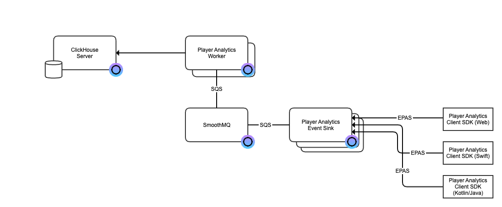

[](https://app.osaas.io/browse/eyevinn-player-analytics-eventsink)

# Player Analytics Client SDK Web

Part of [Eyevinn Player Analytics Specification (EPAS)](https://github.com/Eyevinn/player-analytics-specification). To be used together with [Eyevinn Player Analytics Eventsink](https://github.com/Eyevinn/player-analytics-eventsink)

```
npm install @eyevinn/player-analytics-client-sdk-web
```

## EPAS backend in Open Source Cloud

The quickest way to get started is to setup an EPAS compatible backend in [Eyevinn Open Source Cloud](https://www.osaas.io)



1. Setup an Eventsink in OSC as described in the [documentation](https://docs.osaas.io/osaas.wiki/Service%3A-Player-Analytics-Eventsink.html).
2. Setup an Analytics Worker and Clickhouse Database by following the instructions in the [documentation](https://docs.osaas.io/osaas.wiki/Service%3A-Player-Analytics-Worker.html)
3. Add Clickhouse as datasource in Grafana and start visualizing the metrics

## Usage

### Automatic Event Listening

```js
import { PlayerAnalyticsConnector } from "@eyevinn/player-analytics-client-sdk-web";

// Create your instance and set the analytics eventsink endpoint
const playerAnalytics = new PlayerAnalyticsConnector(
  "https://your-eventsink-url.io"
);

// Initiate the analytics with the base data needed
// This will create you session in the backend
try {
  await playerAnalytics.init({
    sessionId: "generated-unique-uuid-session-id",
  });

  // Get your video element from the site, or your video player of choice
  const videoElement = document.querySelector("video");
  // Load the analytics library with the video element to fetch the events
  playerAnalytics.load(videoElement);
} catch (err) {
  console.error(err);
  // Remove event listeners and heartbeat timers if init fails.
  playerAnalytics.deinit();
}
```

Due to bitrate changes not being reported, and errors not being reported in any descriptive way, there is a possibility to do separate calls for these events - which you may trigger based on you video player of choice following these examples.

```js
playerAnalytics.reportBitrateChange({
  bitrate: 246.440, // bitrate in Kbps
  width: 320, // optional, video width in pixels
  height: 136, // optional, video height in pixels
  videoBitrate: 0, // optional, if available provide the bitrate for the video track
  audioBitrate: 0, // optional, if available provide the bitrate for the audio track
});
```

```js
// error is fatal, i.e. sends an end event as well
playerAnalytics.reportError({
  category: "", // optional, eg. NETWORK, DECODER, etc.
  code: "",
  message: "", // optional
  data: {}, // optional
});

// warning is not fatal
playerAnalytics.reportWarning({
  category: "", // optional, eg. NETWORK, DECODER, etc.
  code: "",
  message: "", // optional
  data: {}, // optional
});
```

```js
// when leaving the player, to stop the analytics in a correct manor
playerAnalytics.reportStop();
playerAnalytics.destroy();
```

### Manual Event Triggering

```js
import { PlayerAnalytics } from "@eyevinn/player-analytics-client-sdk-web";

// Create your instance and set the analytics eventsink endpoint
const playerAnalytics = new PlayerAnalytics("https://your-eventsink-url.io");
await playerAnalytics.initiateAnalyticsReporter({
  sessionId: "generated-unique-uuid-session-id",
  contentId: "big-buck-bunny-720",
  contentUrl:
    "https://test-videos.co.uk/vids/bigbuckbunny/mp4/h264/720/Big_Buck_Bunny_720_10s_1MB.mp4",
});

// then trigger the method calls accordingly, e.g.
const videoElement = document.querySelector("video");
videoElement.addEventListener("play", () => {
  playerAnalytics.playing({
    event: "playing",
    timestamp: Date.now(),
    playhead: 0,
    duration: 3600,
    sessionId: "generated-unique-uuid-session-id",
  });
});
```

### Report Metadata

You can report your metadata at a later stage in your code and tailor ther callbacks for your tech stach, for example when you have parsed your manifest.
In this example we're using hls.js

```js
import Hls from "hls.js";
import { PlayerAnalyticsConnector } from "@eyevinn/player-analytics-client-sdk-web";

// Create your instance and set the analytics eventsink endpoint
const playerAnalytics = new PlayerAnalytics("https://your-eventsink-url.io");
await playerAnalytics.initiateAnalyticsReporter({
  sessionId: "generated-unique-uuid-session-id",
});

const hls = new Hls();
const videoElement = document.querySelector("video");

hls.attachMedia(videoElement);
hls.load(src);
hls.on(Hls.Events.LEVEL_LOADED, (event, data) => {
  playerAnalytics.metadata({
    live: data?.details?.level?.live,
  });
});
```

These are the available keys for metadata, which can be sent anytime between a `init` and a `stopped` call.

```ts
export interface TMetadataEventPayload {
    live?: boolean;
    contentTitle?: string;
    contentId?: string;
    contentUrl?: string;
    drmType?: string;
    userId?: string;
    deviceId?: string;
    deviceModel?: string;
    deviceType?: string;
}
```

### Constructor parameters

These applies to both the `PlayerAnalyticsConnector` and `PlayerAnalytics`.

- `eventsinkUrl`, the url to your event sink.
- `debug`, default false, triggers output to dev console rather than actual http posts.

### Init parameters

```ts
export interface IPlayerAnalyticsInitOptions {
  sessionId?: string; // should be generated by the backend if not sent in
  shardId?: string; // optional grouping or clustering events throughout the 
                    // pipeline to allow sharding at various stages of a pipeline
  hearbeatInterval?: number; //Defaults to 30_000 (ms)
}
```

## Development

Run the demo page by `npm start`

## Release

- Pull latest master
- `npm version patch | minor | major`
- This triggers an update of the version in package.json + creates a tag with that version number
- This will automatically be pushed to Github upon success.
- At github.com go to releases (far right)
  - click "Draft a new release"
  - choose your tag
  - give it a name (preferably your version number, e.g. `v0.0.1`)
  - click "Auto-generate release notes"
  - click "Publish release"
- A Github Action is triggered to do the releases towards the npmjs and github packages repositories.
<br/>
<br/>

# About Eyevinn
We are [Eyevinn Technology](https://www.eyevinntechnology.se/), and we help companies in the TV, media, and entertainment sectors optimize costs and boost profitability through enhanced media solutions. We are independent in a way that we are not commercially tied to any platform or technology vendor. As our way to innovate and push the industry forward, we develop proof-of-concepts and tools. We share things we have learn and code as open-source.

With Eyevinn Open Source Cloud we enable to build solutions and applications based on Open Web Services and avoid being locked in with a single web service vendor. Our open-source solutions offer full flexibility with a revenue share model that supports the creators.

Read our blogs and articles here:

- [Developer blogs](https://dev.to/video)
- [Medium](https://eyevinntechnology.medium.com/)
- [OSC](https://blog.osaas.io)
- [LinkedIn](https://www.linkedin.com/company/eyevinn/)

Want to know more about Eyevinn, contact us at [info@eyevinn.se](mailto:info@eyevinn.se)!

